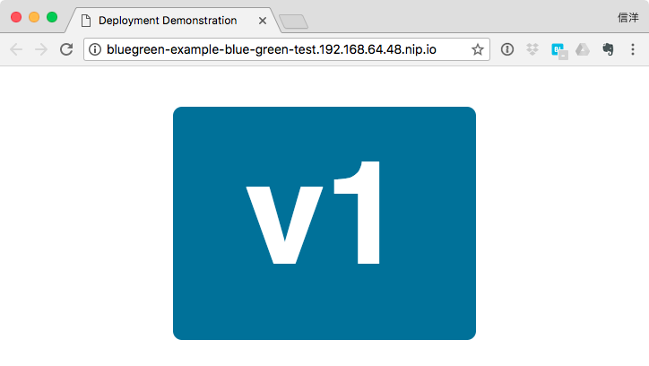
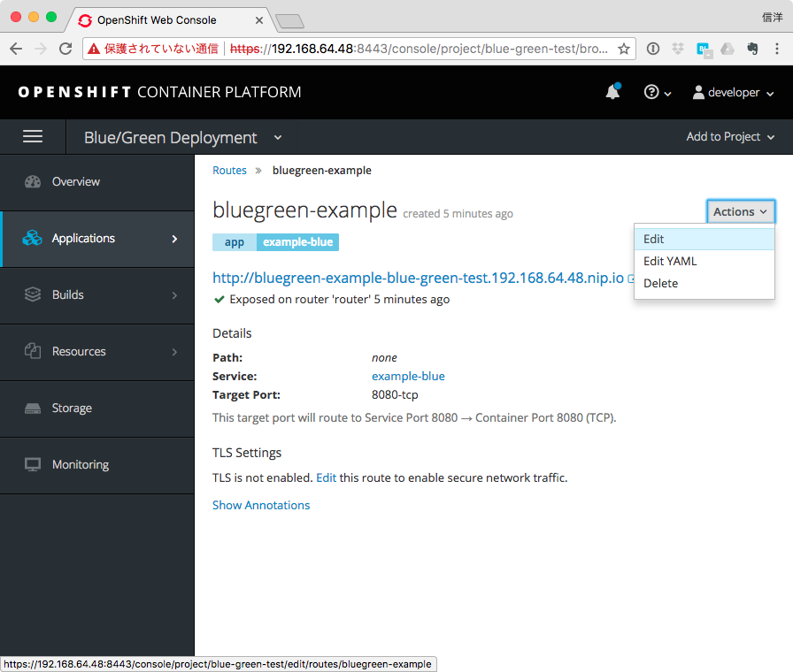
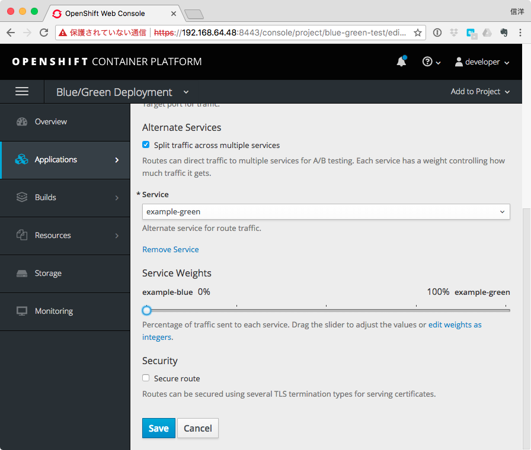
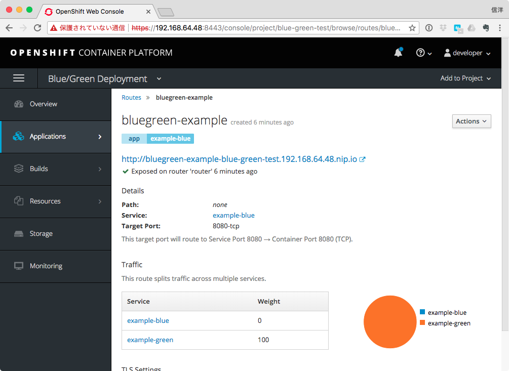
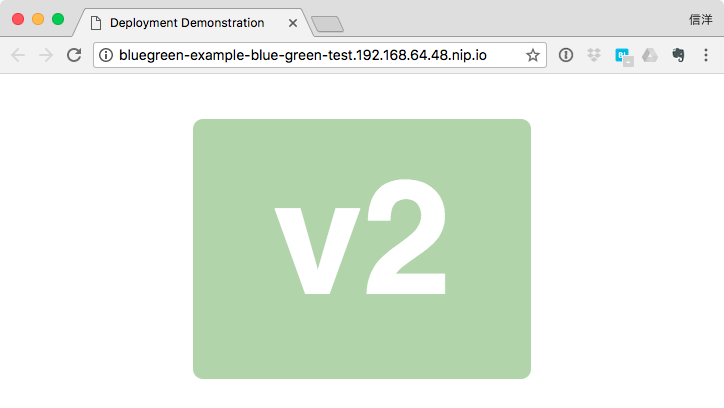

# Blue/Green Deployment


## 環境設定
```
export OCP_MASTER=https://<ocp-master-url>:<port>
```

## プロジェクト作成

```
oc login $OCP_MASTER
oc new-project blue-green-test --display-name="Blue/Green Deployment" --description="Blue/Green Deployment Example"
```

## アプリケーションデプロイ

### Blueバージョン(v1)デプロイ

```
oc new-app openshift/deployment-example:v1 --name=example-blue
```

### Greenバージョン(v2)デプロイ

```
oc new-app openshift/deployment-example:v2 --name=example-green
```

## アプリケーション公開とBlue/Green振り分け設定

### Blueバージョン(v1)を公開
```
oc expose svc/example-blue --name=bluegreen-example
```

以下でURLを確認し、アプリケーション画面を表示してみる。

```
oc get route bluegreen-example --template='{{.spec.host}}'
```



### Greenバージョン(v2)に切替
管理コンソールからRouteのAction-Editを選択


Alternate Servicesの"Split traffic accross multiple services"にチェックを入れ、以下を変更してSave

- Service: ドロップダウンから"example-green"を選択
- Service Weights: スライダーで"example-green"を100%に変更



"example-green"への割り振り比率が100%になっていることを確認


再びアプリケーションにアクセスするとv2に切り替わっていることが確認できる。


### BlueとGreenの混在
管理コンソールからRouteのAction-Editを選択し、Service Weightsを50%:50%に変更する。

ブラウザからアクセスするとstickyが有効なため片方のバージョンしか表示されないので、curlコマンドでテストする。

```
COUNTER=0; \
while [ $COUNTER -lt 10 ]; do \
  curl -s "http://$(oc get route bluegreen-example --template='{{.spec.host}}')" \
  | grep '"box"'; \
  let COUNTER=COUNTER+1 ; \
done
```

以下のように、v1とv2が交互に表示される。
```
<div class="box"><h1>v1</h1><h2></h2></div>
<div class="box"><h1>v2</h1><h2></h2></div>
<div class="box"><h1>v1</h1><h2></h2></div>
<div class="box"><h1>v2</h1><h2></h2></div>
<div class="box"><h1>v1</h1><h2></h2></div>
<div class="box"><h1>v2</h1><h2></h2></div>
<div class="box"><h1>v1</h1><h2></h2></div>
<div class="box"><h1>v2</h1><h2></h2></div>
<div class="box"><h1>v1</h1><h2></h2></div>
<div class="box"><h1>v2</h1><h2></h2></div>
```

Service Weightsをいろいろ変えて試してみるとよい。

## 後始末
```
oc delete project blue-green-test
```
