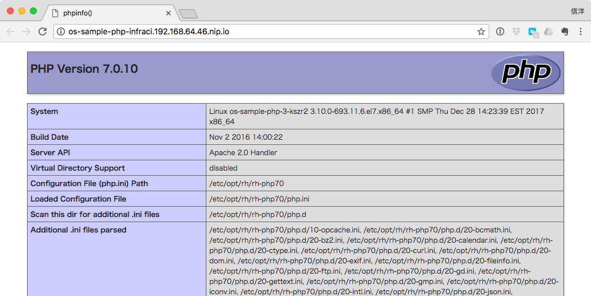
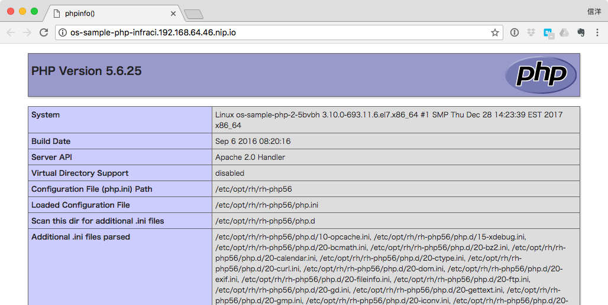

# インフラCI
アプリケーションの変更がなく、ミドルウェアやベースイメージのみが変更された場合に、影響を受けるコンテナイメージを自動的に再ビルドしてデプロイする。

## 環境設定
```
export OCP_MASTER=https://<ocp-master-url>:<port>
```

## 事前準備
サンプルコード(PHP)

https://github.com/OpenShiftDemos/os-sample-php

s2iビルドでこちらをビルドしておき、ベースイメージをphp:latestに変更しておく。

```
oc new-project infraci
oc new-app https://github.com/OpenShiftDemos/os-sample-php
oc patch bc os-sample-php -p \
 '{"spec":{"strategy":{"sourceStrategy":{"from":{"name": "php:latest"}}}}}'
```

## アプリケーション実行
アプリケーションを公開しておく。(GUIからテンプレートを実行した場合は不要。)
```
oc expose svc os-sample-php
```

以下でURLを確認し、アプリケーション画面を表示してみる。

```
oc get route os-sample-php --template='{{.spec.host}}
```



`phpinfo()`のバージョン表示が7.0になっていることを確認。


## ベースイメージ変更による自動ビルドとデプロイ
ImageStreamタグのlatestを5.6に変更する。
openshiftネームスペースのImageStreamを操作するため、管理権限のあるユーザーでログインしてから操作する。

```
oc login $OCP_MASTER -u system:admin
oc tag php:5.6 php:latest -n openshift
```

これにより以下が実行される:

- image change triggerによって自動的にビルドが実行される
- image change triggerによって自動的にデプロイが実行される

デプロイが完了したら、アプリケーション画面からPHPのバージョンを確認する。



次に、latestを7.0に変更してみる。

```
oc tag php:7.0 php:latest -n openshift
```

同様にビルド、デプロイが行われる。

## 履歴確認(ImageStream)

```
oc describe is php -n openshift

Name:			php
Namespace:		openshift
Created:		2 hours ago
Labels:			<none>
Annotations:		openshift.io/display-name=PHP
			openshift.io/image.dockerRepositoryCheck=2018-02-26T08:25:52Z
Docker Pull Spec:	172.30.1.1:5000/openshift/php
Image Lookup:		local=false
Unique Images:		3
Tags:			4

latest
  tagged from php@sha256:e27b8848aeecd8fa5cb0c08e6951823375d2b944b5200c72da53a9700d4d3ddf

  * registry.access.redhat.com/rhscl/php-70-rhel7@sha256:e27b8848aeecd8fa5cb0c08e6951823375d2b944b5200c72da53a9700d4d3ddf
      About a minute ago
    registry.access.redhat.com/rhscl/php-56-rhel7@sha256:2ccd499a6082be8dd931e7bf5ec4984307dcf2d029d115213cf9576eddfbf937
      6 minutes ago
    registry.access.redhat.com/rhscl/php-70-rhel7@sha256:e27b8848aeecd8fa5cb0c08e6951823375d2b944b5200c72da53a9700d4d3ddf
      2 hours ago

7.0
  tagged from registry.access.redhat.com/rhscl/php-70-rhel7:latest

  Build and run PHP 7.0 applications on RHEL 7. For more information about using this builder image, including OpenShift considerations, see https://github.com/sclorg/s2i-php-container/blob/master/7.0/README.md.
  Tags: builder, php
  Supports: php:7.0, php
  Example Repo: https://github.com/openshift/cakephp-ex.git

  * registry.access.redhat.com/rhscl/php-70-rhel7@sha256:e27b8848aeecd8fa5cb0c08e6951823375d2b944b5200c72da53a9700d4d3ddf
      2 hours ago

5.6
  tagged from registry.access.redhat.com/rhscl/php-56-rhel7:latest

  Build and run PHP 5.6 applications on RHEL 7. For more information about using this builder image, including OpenShift considerations, see https://github.com/sclorg/s2i-php-container/blob/master/5.6/README.md.
  Tags: builder, php
  Supports: php:5.6, php
  Example Repo: https://github.com/openshift/cakephp-ex.git

  * registry.access.redhat.com/rhscl/php-56-rhel7@sha256:2ccd499a6082be8dd931e7bf5ec4984307dcf2d029d115213cf9576eddfbf937
      2 hours ago

5.5
  tagged from registry.access.redhat.com/openshift3/php-55-rhel7:latest

  Build and run PHP 5.5 applications on RHEL 7. For more information about using this builder image, including OpenShift considerations, see https://github.com/sclorg/s2i-php-container/blob/master/5.5/README.md.
  Tags: hidden, builder, php
  Supports: php:5.5, php
  Example Repo: https://github.com/openshift/cakephp-ex.git

  * registry.access.redhat.com/openshift3/php-55-rhel7@sha256:c82d399564d21b9737ac58c1c812c31c42b4afc94443a8e276cd63979dde2930
      2 hours ago
```

ImageSteamの履歴が参照できる。

## 後始末
```
oc delete project infraci
```
